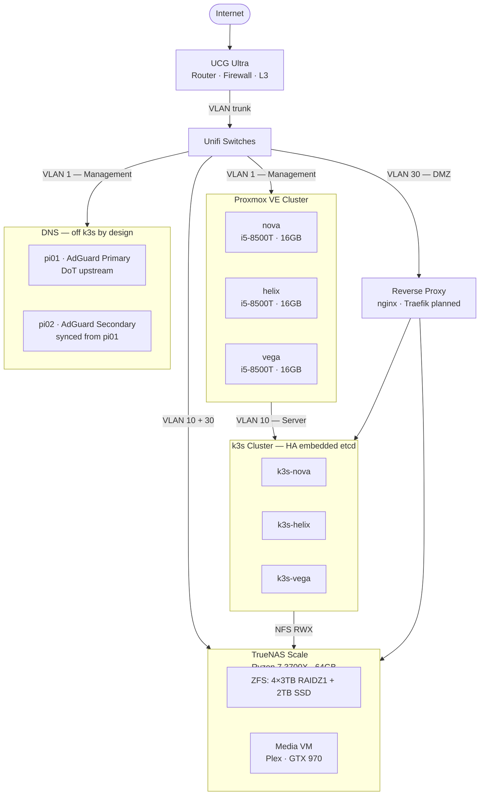

# homelab-automation

Infrastructure-as-Code for my personal homelab. Everything that runs here is provisioned and configured through this repository — no manual clicking, no snowflake servers.

This repo is the operational backbone of a multi-node cluster running on recycled hardware. It started as a Synology NAS and a single Proxmox node, and has grown into something I'm genuinely proud of.

---

## Architecture



**Network:** 5 VLANs (Management · Server · Client · DMZ · Untrust) on Unifi, trunked to all nodes. Inter-VLAN firewall rules enforce least-privilege access. See [`docs/network.md`](docs/network.md).

---

## Stack

| Layer | Technology |
|-------|-----------|
| Hypervisor | Proxmox VE (3-node cluster) |
| NAS / VMs | TrueNAS Scale |
| VM Provisioning | Terraform · telmate/proxmox provider |
| Configuration | Ansible |
| Container Orchestration | k3s (HA, embedded etcd) |
| GitOps | ArgoCD (App-of-Apps pattern) |
| Ingress | Traefik |
| Certificates | cert-manager + Step-CA (self-hosted ACME CA) |
| Storage (stateful) | Longhorn (RWO, replicated across 3 nodes) |
| Storage (shared) | TrueNAS NFS (RWX — media, Nextcloud) |
| DNS | AdGuard Home (2× Raspberry Pi 4) · DNS-over-TLS upstream |
| Secrets | Sealed Secrets (kubeseal, committed to Git) |
| SSO | Authentik |
| Monitoring | Prometheus + Grafana + Alertmanager |
| OS Template | AlmaLinux 9 Cloud-Init (custom-built) |
| Offsite Backup | Hetzner Storage Box via rclone crypt |

---

## Repository Structure

```
terraform/
└── proxmox/              # VM definitions (k3s nodes, utility VMs)

ansible/
├── inventories/          # Hosts, group_vars, host_vars
└── playbooks/
    ├── proxmox/          # PVE node configuration
    ├── truenas/          # ZFS pools, datasets, NFS, cloud sync, TLS
    ├── pi/               # AdGuard Home, DNS, bootstrap
    └── k3s/              # k3s bootstrap + node configuration

docs/
├── current.md            # Current state (hardware, network, services, IPs)
├── target.md             # Target architecture + decisions
├── roadmap.md            # Phased migration plan with task tracking
├── network.md            # VLAN layout, switch topology, firewall design
└── learnings.md          # Debugging notes and lessons learned
```

The Kubernetes application manifests live in a separate repo (`k3s-manifests`) following a GitOps monorepo layout with ArgoCD App-of-Apps.

---

## Approach & Values

**Everything is code.** VMs are provisioned via Terraform, OS configuration happens through Ansible, Kubernetes apps are deployed via ArgoCD from Git. If something isn't in a file, it doesn't exist.

**Decisions are documented.** The `docs/` folder tracks not just what runs, but why. Rejected options, tradeoffs, and the reasoning behind architectural choices are written down — future me will be grateful.

**Phased, not big-bang.** The homelab is mid-migration. Rather than rebuilding everything at once, changes are planned in phases with clear prerequisites and rollback paths. The roadmap tracks open tasks, blockers, and done items honestly.

**Pragmatic over perfect.** NFS for shared storage, Longhorn for stateful workloads — the right tool for the job, not the most impressive one. Hardware is recycled (ex-office PCs, ex-Synology disks) where it makes sense.

**Disaster recovery is a first-class concern.** Four independent backup layers: data on Hetzner (rclone crypt), VM backups via PBS, Longhorn snapshots replicated to TrueNAS NFS, and config in Git with an offsite mirror. Any single layer failing is not a data loss event.

---

## Services

All behind Step-CA TLS, unified under Authentik SSO:

- **Media:** Plex · Radarr · Sonarr · Lidarr · Prowlarr · Seerr · NZBGet · Tautulli · Audiobookshelf · YTdl-Material
- **Productivity:** Nextcloud · Firefly III · Mealie · Paperless-ngx
- **Infrastructure:** AdGuard Home · Uptime Kuma · Homepage · Gotify · Cloudflare DynDNS · Step-CA
- **Platform:** ArgoCD · cert-manager · Longhorn · Sealed Secrets · Authentik
- **Planned:** GitLab (self-hosted, GitHub mirror) · HomeAssistant · Ollama

---

See [`docs/roadmap.md`](docs/roadmap.md) for current status and what's next.
